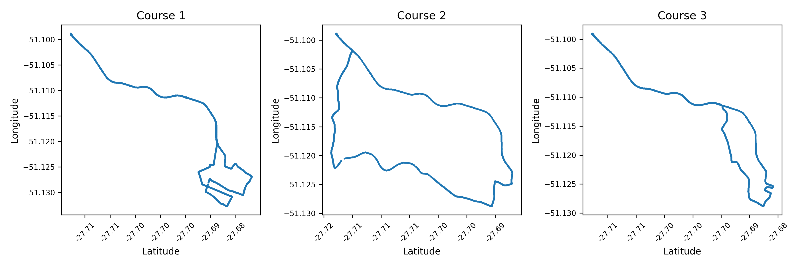
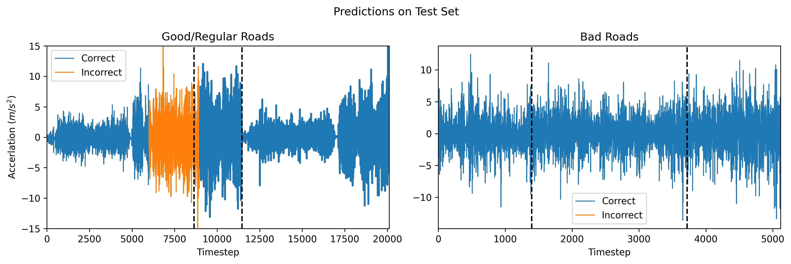

# Passive Vehicle Sensor Analysis

## Abstract

We investigate the application of passive vehicle sensor data for estimating real-time road surface conditions and the vehicle's state vector. While noise from physical imperfections, the motion of the engine, and sensor reading errors is inevitable, these factors significantly affect the accuracy of the data collected. Implementing a Kalman filter enables more accurate vehicle position, velocity, and acceleration estimation.
While spectral clustering is unable to reliably determine road conditions, hidden Markov models prove effective in accurately predicting road quality through passive sensor data.

## Problem Statement and Motivation

Autonomous vehicle systems rely on a variety of data inputs to ensure safe navigation. Sensors including GPS trackers, accelerometers, and gyroscopes, among many others, provide crucial information about the surrounding environment to assess and navigate current road conditions. This information helps autonomous systems make informed decisions in real-time, enhancing safety and efficiency on the road. Therefore, integrating sensor data is vital for advancing autonomous and safe transportation systems.

Autonomous systems become increasingly powerful as their data increases in accuracy and reliability. Filtering and improving vehicle sensor data is an active area of research with a variety of effective published techniques. One such example is a deep neural network architecture known as CarSpeedNet that predicts car speed using accelerometer data from smartphones \cite{or2024}. Tesla’s Autopilot leads the cutting edge in applying artificial intelligence to create safe driving environments and provide the autopilot feature with accurate information about the vehicle's physical behavior \cite{tesla2024}. \cite{menegazzo2021} experiments with various CNN and LSTM architectures on our same dataset to distinguish between road types. Others apply Kalman filtering to odometry and sonar signals to ensure accurate positioning and navigation for autonomous robots and vehicles \cite{859866}.

We seek to answer the following questions: how can we improve the accuracy of vehicle sensors and how can we determine road conditions as a vehicle drives. Our paper contributes to the advancement of vehicle behavior measurement and road condition prediction which are crucial components for enhancing driving safety and autonomous vehicle capabilities. 

## Data

The Passive Vehicular Sensors Dataset (PVS) was compiled by researchers at the Universidade Federal de Santa Catarina \cite{9277846}. This dataset is available on Kaggle and contains data from three sets of accelerometers, gyroscopes, magnetometers, thermometers, and GPS trackers. The data comes from three different drivers each driving vehicles on three different routes mapped in Figure \ref{fig:three_courses}, for a total of nine unique scenarios. 

Latitude and longitude data from one driver on the three different courses.

The dataset includes a variety of general information such as latitude, longitude, altitude, and speed. It also includes inertial, gyroscopic, and temperature data from five sensors around the suspension and dashboard. The dataset also provides nominal data that describes the road type (paved, unpaved, dirt, cobblestone, asphalt), road quality (good, regular, bad), and whether speed bumps are present. 

We exclude columns containing irrelevant metadata and missing data from the analysis to focus on informative features for vehicle state and road condition estimation. Our final dataset contains just over one million rows with samples taken every millisecond for a total of three hours of driving data. We allocate six datasets from the first two driving locations for training, two datasets from the remaining location for testing, and the last dataset for validation.

While the dataset is well constructed and compiled by a reliable source, the methods we explore seek to reduce the inaccuracies inherent in this type of noisy vehicle sensor data. 

## Methods

### Feature Engineering

Since the dataset comes cleaned and well prepared in advance, we only create two additional types of features. The first is a smoothed version of the original accelerometer data. We smooth the noisy data by computing the moving average of the acceleration using a 200 millisecond window size. Smoothing helps reduce noise and fluctuations in the sensor readings to create cleaner and more interpretable data for analysis. 

Another critical feature we engineer is the distance from the starting location in meters. We construct this column by converting latitude and longitude coordinates to meters using Vincenty's formula for the geodesic distance between two points. This approximation accounts for the curvature of the Earth's surface and converts the units for position from coordinates to meters and standardizes the units for location with the rest of the features.

### Kalman Filter

Another critical feature we engineer is the distance from the starting location in meters. We construct this column by converting latitude and longitude coordinates to meters using Vincenty's formula for the geodesic distance between two points. This approximation accounts for the curvature of the Earth's surface and converts the units for position from coordinates to meters and standardizes the units for location with the rest of the features.

#### State Equations

$$
\mathbf{x}_{k+1} = F_{k}\mathbf{x}_k + \mathbf{w}_k \\
\mathbf{z}_k = H_k\mathbf{x}_k + \mathbf{v}_k
$$

#### Hidden and Observed States
$$
\mathbf{x}^T = \begin{bmatrix} x(t) & y(t) & z(t) & \dot{x}(t) & \dot{y}(t) & \dot{z}(t) & \ddot{x}(t) & \ddot{y}(t) & \ddot{z}(t) \end{bmatrix}
$$

$$
\mathbf{z}^T = \begin{bmatrix} x(t) & y(t) & z(t) & \ddot{x}(t) & \ddot{y}(t) & \ddot{z}(t) \end{bmatrix}
$$

#### Transition Matrices
$$
F = \begin{bmatrix} I_9 \\ \end{bmatrix} + 0.1 \times \begin{bmatrix} 0_{6\times3} & I_6 \\ 0_{3\times3} & 0_{3\times6} \end{bmatrix}
$$

$$
H = \begin{bmatrix} I_3 & 0_{3\times3} & 0_{3\times3} \\ 0_{3\times3} & 0_{3\times3} & I_3 \end{bmatrix}
$$

We construct the $F$ matrix by observing that acceleration is the derivative of velocity with respect to time, and velocity is the derivative of position. In order to estimate the derivatives for position, we add the current position and the product of time step and velocity, where the time step is $0.1$. We perform a similar operation for velocity and acceleration. 

We do not include a control variable $u$ since we do not have data for the throttle position or brake position. Finally, we let the vectors $w$ and $v$ represent noise in the hidden state and observation state, respectively.

Before applying the Kalman filter, we downsample the original location data by $90\%$ to allow the filter to more easily identify the true state as shown in Figure \ref{fig:kalman_downsize}. Downsampling leaves enough information to sufficiently convey the data the GPS records without forcing the Kalman filter to overfit with erratic jumps in estimated position.

Comparing the x position results from the Kalman Filter trained on the original data and the downsized data.

### Clustering

K-means is a clustering algorithm that works by assigning data points to the nearest cluster center (centroid), then iteratively updating to minimize the total distance between each point and its assigned center. On the other hand, spectral clustering analyzes the connections and similarities between data points. The model transforms this map of connections into a new space that distinguishes the clusters even more. This approach is robust to noise and can handle high dimensional data well.

We compare the performance of these two unsupervised clustering techniques in predicting the type of road. We train this model on gyroscope and accelerometer information in the x, y, and z directions. We also create additional features for each sample by computing the mean, variance, minimum, and maximum of the twenty data points closest in time to each sample to capture the broader context of each data point. We balance the training data by randomly sampling equal numbers of points per label (paved and unpaved).

### Hidden Markov Model (HMM)

Hidden Markov Models (HMMs) model systems with hidden states that generate observable outputs (emissions). Each state emits specific outputs and transitions probabilistically. HMMs can estimate the most likely hidden state explaining an observation sequence, making them valuable for tasks like speech recognition. We apply this model to predict the quality of road (hidden) based on the vertical acceleration data (observations). In this model, the hidden states are latent variables that do not directly represent information we are interested in but still encode relevant information useful for making predictions.

To train and test the model, we concatenate the data, then separate "bad" from "good/regular" indices to create a different dataframe for each class. We then train one GMMHMM on the "good/regular" data and another on the "bad'' data. The model makes a prediction for each time window by setting the two HMMs in competition against each other. The model predicts "good/regular" if the scaled log probability from the corresponding HMM is higher, and ``bad" otherwise. This rescaling factor essentially shifts the decision boundary between the good and bad classifications. We can find the optimal rescaling factor using a grid search over scales between $0.5$ and $2.0$. This optimization achieves the most favorable balance between true positives and false positives, similar to optimizing with a ROC curve. We also perform a grid search over the number of components and test hyperparameters between two and eight (inclusive). See Table \ref{tab:hmm_accuracyy} for more details.

## Results and Analysis

### Determining True Position and Acceleration

The Kalman filter's core functionality lies in refining noisy sensor observations to estimate the true state of a system, including both position and acceleration. In Figure \ref{fig:kalman}, we see that the model filters the noise in acceleration data so that the result is less volatile while also accurately predicting position. Figure \ref{fig:kalman_zoomed} shows the same data on a smaller time interval to better visualize how the model performs. 

Kalman filter results compared to the original observed data.

Kalman filter results zoomed in to highlight model trends.

### Predicting Road Quality

Our clustering models are unable to discern the differences between asphalt, dirt, and cobblestone road types reliably. When clustering into three groups, the K-means model only achieves $30\%$ accuracy, while the spectral model achieves $45\%$ accuracy. This poor accuracy indicates that the clustering models are unable to identify the correlation between the type of road and the data. 

Since the three-class models are unsuccessful, we attempt to train two-class models to discover if they more accurately predict paved and unpaved roads. The K-means model achieves $50\%$ accuracy, while the spectral model achieves $80\%$ accuracy. However, the full confusion matrix indicates that the spectral model's high performance is primarily due to the disproportionate ratio of paved road over unpaved road labels in the data (see Fig \ref{fig:2_clusters}). We address this issue by sampling an equal number of paved and unpaved data points. However, this approach also produces poor results, suggesting that clustering algorithms may not be well-suited to capture the subtle differences between road types based solely on gyroscope and vertical accelerometer data. 

Confusion matrices for a K-means model and a spectral clustering model. Neither model accurately discerned between "paved" and "unpaved" road types.

HMM prediction results. The sections in blue are time steps where the model predicted the road quality correctly, while orange indicates incorrect predictions. The vertical dotted black lines mark the splits between the three different drive data sources.

Fig. \ref{fig:hmm_result} visualizes the road quality predictions from the second approach for predicting road type. This method relies on an HMM to learn from the raw acceleration data in the vertical direction recorded with the accelerometer on the dashboard. After performing a grid search over all possible combinations of n\_components and rescaling factors, the model performed best with five components and rescaling the prediction confidence by $0.98$. This model classifies "good/regular" roads with $85.7\%$ accuracy and "bad" roads with $100\%$ accuracy. Since $80\%$ of the labels are "good" and $20\%$ are labeled "bad", the model's overall accuracy is $88.6\%$. For testing purposes, the model only makes predictions on thirty second intervals because the road quality does not change very frequently. Consequently, some of the prediction error might arise from intervals that contain both "good/regular" roads and ``bad" roads.

TABLE
Accuracy Results of a grid search over the number of parameters in each HMM before optimizing the rescaling factor.

These results demonstrate the HMM’s effectiveness in capturing the underlying dynamics of road quality based on acceleration data. This suggests a strong correlation between vertical acceleration and the hidden emission states associated with good and bad road conditions. This predictive power paves the way for deploying such models for real-time road assessment tasks. 

## Ethical Considerations

While there are several ethical issues that arise from this project, we consider several factors that may affect the results and consequences of our findings. The technology to passively and autonomously collect road quality data may impact certain communities if this data is interpreted or applied inappropriately. Poor quality roads may be associated with lower economic areas, so it is important that these routes remain anonymous. In this study, all participant information remains confidential. 

However, if the algorithms are used to allocate road maintenance resources, a model biased towards well-maintained roads might continuously prioritize repairs in wealthier areas. This could create a negative feedback loop where poorer areas with lower quality roads receive even fewer resources, worsening their condition over time. Decision makers must combine algorithmic data analysis with human expertise to ensure informed choices when allocating resources.

We also acknowledge the inherent challenge in assessing the reliability of this data and validating the accuracy of the measurements. While our models reduce some of this variability, we recognize that error may still permeate our results. As a consequence, these findings should be weighed carefully with other factors while making impactful decisions. 

## Conclusion

In this investigation, we seek to accurately clean noise from position and acceleration using a Kalman filter. We also leverage hidden Markov models and clustering techniques to passively predict road quality. 

Kalman filtering proves highly effective in eliminating noise from acceleration data and providing accurate predictions of the vehicle's position. Further research could investigate adaptive Kalman filters that adjust their internal parameters in real-time based on changing environmental conditions. A future investigation could also include extra parameters in the state space to incorporate additional complexity and handle features such as "jerk" or "bumps". These changes may lead to improved noise reduction and prediction accuracy across diverse driving scenarios. 

Our exploration of road quality prediction reveals that hidden Markov models significantly outperform clustering techniques. Neither spectral clustering nor K-means clustering accurately identify road quality trends using only accelerometer and gyroscope data. In contrast, after optimizing hyperparameters, our HMM achieves high accuracy in predicting both "good" and "bad" road quality.

Regardless of the model's success, future work might also explore various data preprocessing techniques. Including more customized smoothed data could potentially enhance the performance of the HMM and other models. While clustering methods prove inadequate, future research should explore more promising models for this type of problem such as neural networks in order to achieve further improvements.
## Repository Link

For full source code and charts, visit the [GitHub repository](https://github.com/binDebug3/CarKalmanFilter).
